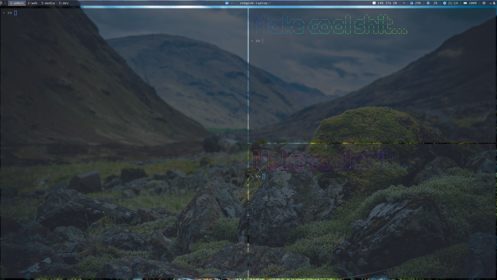
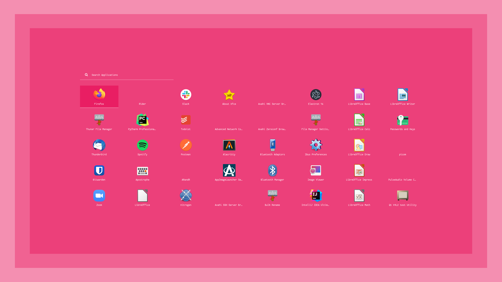
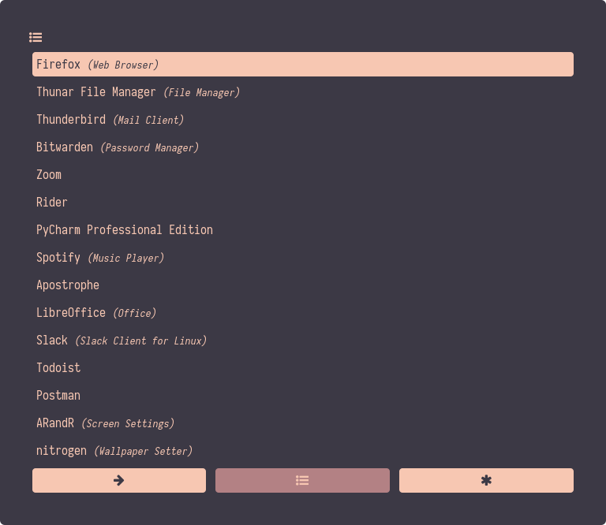

# README #

This is a bunch of scripts designed to take the base Arch Linux iso to a fully functional GUI.

There are several key sections to this README:

* [Installing Arch](#markdown-header-installing-arch)
* [Choosing Xorg or Wayland](#markdown-header-xorg-or-wayland)
* [Choosing a window manager](#markdown-header-choosing-a-window-manager)
* [Generic setup](#markdown-header-generic-setup)
* [GPU support](#markdown-header-gpu-support)
	* [Gaming](#markdown-header-gaming)
		* [Steam](#markdown-header-steam)
* [Setting up Xorg](#markdown-header-setting-up-xorg)
	* [i3](#markdown-header-i3)
	* [Xmonad](#markdown-header-xmonad) 
* [Setting up Wayland](#markdown-header-setting-up-wayland)
	* [Sway](#markdown-header-sway)
* [Key System Items](#markdown-header-key-system-items)
	* [Audio](#markdowon-header-audio)
	* [Trackpad](#markdown-header-trackpad)
	* [Dictionaries & Spelling](#markdown-header-dictionaries-spelling)
	* [Multiple Screens](#markdown-header-multiple-screens)
	* [Keyboard](#markdown-header-keyboard)
* [Key UI elements](#markdown-header-key-ui-elements)
* [Optional extras](#markdown-header-optional-extras)
	* [Generic](#markdown-header-generic)
	* [Greeters](#markdown-header-greeters)
	* [Sway Only](#markdown-header-sway-only)

This is what the final result will look like:










## Installing Arch ##

A lot of the following info can be found online and a good place to start is [on the Arch Wiki](https://wiki.archlinux.org/title/installation_guide). The following section will be a very succinct helper guide.

1. Get the latest ISO file from [here](https://archlinux.org/download/). Choose your mirror and get the x86_64.iso.
1. Create a boot USB. There are several ways to do this. The easiest and most user friendly is to use a tool like [Etcher](https://www.balena.io/etcher/). 
1. Boot from that USB, different systems have different ways of doing this, a bit of Googling may be required.
1. *(Optional)* Set keyboard layout - once you've booted into the live environment, you may need to set your keyboard layout (default is US).To list options run `ls /usr/share/kbd/keymaps/**/*.map.gz`
Then use the `loadkeys` program to change the layout if desired, (e.g. `loadkeys de-latin1`). This will not have an effect on the final keyboard layout so is only for installing and setting up the system.
1. Ensure you have an internet connection - if you need to connect to a wifi network then you can use the `iwctl` prompt to discover network and connect. [See here for instructions](https://wiki.archlinux.org/title/Iwd#iwctl). 
1. Set the system clock - `timedatectl set-ntp true`
1. Format the disk for the system. ***NOTE*** This is where things can go wrong so be careful and make sure you are not overwriting stuff you cannot afford to lose. Do the following:
	1. Discover the correct disk - run `fdisk -l` and make sure to pick out the correct disk on which you want to install the system. The disk may already have some partitions on it, you should ignore these and just get the main volume name (e.g. `/dev/sdb` rather than `/dev/sdb1`). We will assume that the disk is `/dev/disk` for this guide but it could be anything.
	1. Enter `fdisk` interactive mode by running `fdisk /dev/disk`.
	1. Create a new GPT partition table by hitting the `g` key.
	1. Create a new boot partition - hit the `n` key, use default partition number 1, use default first sector, for last sector enter +550M (550 Mb partition size).
	1. Create a new swap partition - hit the `n` key, use default partition number 2, use default first sector, choose +8G for the last sector (8 Gb partition size). *Note*: The swap size can vary [see this article](https://itsfoss.com/swap-size/) on how to choose the right size for you.
	1. Create a new root partition - hit the `n` key, use default partition number 3, use default first sector and default last sector (fill up remaining space). This is going to be the main file system.
	1. Format the boot partition to EFI System - hit the `t` key, choose partition 1 and then choose alias 1.
	1. Format the swap partition - hit the `t` key, choose partition 2 and then choose alias 19. The root partition will already linux filesystem (ext4)
	1. Hit the `w` key to save all those changes.
	1. ***NOTE:*** For these next steps you will need to select the partitions you just created. Make the ext4 filesystem in partition 3 - `mkfs.ext4 /dev/disk3`
	1. Make the fat 32 filesystem for partition 1 - `mkfs.fat -F 32 /dev/disk1`
	1. Make the swap filesystem for partition 2 - `mkswap /dev/disk2`
1. Now we are ready to install the base system on the disk. Mount the root partition to the live system - `mount /dev/disk3 /mnt`. This will create a folder called `/mnt` in the live environment that is linked to `/dev/disk3`, our root partition. We can now write to it.
1. If we created a swap partition we need to turn it on: `swapon /dev/disk2`
1. Install the base system - `pacstrap /mnt base linux linux-firmware`.
1. Generate the file system table - `genfstab -U /mnt >> /mnt/etc/fstab`.
1. Chroot into the main partition (kinda like logging in as root but for more on what it actually is [see here](https://en.wikipedia.org/wiki/Chroot)). `arch-chroot /mnt`.
1. Set up the local timezone - all timezones can be found in `/usr/share/zoneinfo/`. Choose your one and then run (example for London timezone) `ln -sf /usr/share/zoneinfo/Europe/London /etc/localtime`. This creates a symlink that the system reads to get the local time.
1. Synchronise the hardware clock - `hwclock --systohc`
1. Set the locale (language). For this you will need a text editor `nano` is easy and `vim` harder but more complete. This guide will use `vim` but replace with `nano` if required. Install editor `pacman -S vim`. Edit `vim /etc/locale.gen` find your locale and uncomment. I am only using `en_GB.UTF-8 UTF-8` but you can use as many as you want. Once complete, save the edit and run `locale-gen`. Finally modify / create the file `vim /etc/locale.conf` and add the line `LANG=en_GB.UTF-8` or your chosen preferred locale. You can only choose one here.
1. Set up network connections e.t.c. - modify / create `vim /etc/hostname` and add the name of the computer - i am using `rob-laptop`. It can be anything. Next modify `vim /etc/hosts` and add the following lines: 
	1. `127.0.0.1	localhost`
	1. `::1	localhost`
	1. `127.0.1.1	rob-laptop.localdomain	rob-laptop` (replace rob-laptop with your host name)
1. Set a root password - `passwd` and then enter the password twice when prompted.
1. Add a new user (i am adding one called rob) - `useradd -m rob`
1. Set a password for the new user - `passwd rob`
1. Add the new user to some key groups - `usermod -aG wheel,audio,video,optical,storage rob`
1. Install `sudo` so the new user can get root permissions for certain tasks - `pacman -S sudo`.
1. Add the new user to the `sudoers` file - `EDITOR=vim visudo` - find the line that reads `wheel ALL=(ALL:ALL) ALL` and uncomment it. Also add the line: `rob ALL=(ALL:ALL) ALL` and replace rob with whoever your user is.
1. Install grub for booting - `sudo pacman -S grub efibootmgr dosfstools os-prober mtools`. 
1. Make the boot directory - `mkdir /boot/EFI` - ***NOTE:*** This guide assumes your are on an EFI system, which most modern ones are.
1. Mount the boot partition on the boot directory - `mount /dev/disk1 /boot/EFI`.
1. Install grub - `grub-install --target=x86_64-efi --bootloader-id=grub_uefi --recheck`.
1. Save the grub config - `grub-mkconfig -o /boot/grub/grub.cfg`.
1. We are almost done with the base installation - just some helper libs - `pacman -S networkmanager git base-devel` and enable network manager `systemctl enable NetworkManager`.

#### Cleanup & Reboot ####

Now we need to exit the live environment and actually boot into our installed system. Run `exit` to get out of the chroot and then run `umount -l /mnt` followed by `reboot`.

When you reboot you will be asked for a user and their password, you should choose the user you created.

#### One final helper ####

Arch has several repositories of software and we will be using 4:

* Core
* Multilib
* AUR
* Chaotic AUR

For accessing the AUR you can use either `yay` or `paru`. I will set up `yay` in this guide. As non root user, run:

```
git clone https://aur.archlinux.org/yay.git
cd yay
makepkg -si
cd ..
rm -rf yay
```


## Xorg Or Wayland ##

I am going to be mega simple, for proper info [see here](https://linuxiac.com/xorg-x11-wayland-linux-display-servers-and-protocols-explained/).

The main difference is this:

Xorg is old and not as efficient or modern as it should be. 

Wayland is new, more efficient and is the future.

You may think, great, let's use Wayland and crack on but there are several gotchas:

* As with every piece of new tech, Wayland is not fully supported yet by a lot of software and maintainers. X11 compatibility layers are not great yet either.
* As Xorg (X11) is mature (very mature) there is a lot of documentation on it.

Most things work on Wayland, but if you are using this setup for anything serious, especially work, then Xorg is the safe bet.

## Choosing A Window Manager ##

Now you have chosen a window server, you actually need to choose the window manager that will issue the commands to the server and draw the windows e.t.c. This choice very much depends on which server you have gone with. For this guide I am only writing about my favourites, however there are loooooaaaaads which you can choose to install with online support.

Wayland:

* Sway (wayland equivalent of i3)

Xorg:

* i3
* Xmonad

These are all tiling window managers.

## Generic Setup ##

There is some setup we are going to want to do regardless of the system we have chosen.

The following utils are useful:

```
sudo pacman -S network-manager-applet dunst linux-headers xdg-user-dirs xdg-utils xdg-desktop-portal gvfs nfs-utils bluez bluez-utils pulseaudio-alsa alsa-utils pipewire pipewire-alsa pipewire-pulse pipewire-jack pavucontrol playerctl bash-completion reflector acpi acpi_call acpid ntfs-3g pass libsecret seahorse wmname dex polkit polkit-gnome ttf-font-awesome
```

***Note: when running this you will be asked which version of xdg-user-dirs to install. For Wayland choose the wlr one (wrlroots) otherwise just choose the default.***

```
yay -S ly lux ttf-paratype
```

* network-manager-applet - for showing a network tool in the system tray
* dunst - for notifications
* linux-headers - ?? but seems required
* xdg-user-dirs xdg-utils xdg-desktop-portal - useful for creating and managing a standard user folder structure to which you will be used
* gvfs nfs-utils - virtual file system managers, required for things like rubbish bins in file managers
* bluez bluez-utils - bluetooth support
* pulseaudio-alsa alsa-utils pipewire pipewire-alsa pipewire-pulse pipewire-jack pavucontrol - for audio support
* playerctl - for playback controls for things like spotify
* bash-completion - for terminal bash completion
* reflector - to keep mirrors updated
* acpi acpi_call acpid - system device comms helper
* pass libsecret seahorse - secret keepers
* wmname - to set the window manager name so java programs don't crash
* dex - to support .desktop files
* polkit polkit-gnome - so user space programs can request sudo access
* ly - a very simple login manager
* lux - a program to control the backlight
* ttf-font-awesome - font awesome glyphs
* ttf-paratype - collection of fonts

A couple of other options:

* `sudo pacman -S tlp` - for power management on laptops
* `sudo pacman -S cups hplip` - for generic and hp printer support

You will then need to enable some services:

```
sudo systemctl enable bluetooth.service
sudo systemctl enable cups.service # if installed
sudo systemctl enable tlp # if installed
sudo systemctl enable reflector.timer
sudo systemctl enable fstrim.timer
sudo systemctl enable acpid
sudo systemctl enable ly # if installed
```

Finally you can generate the user file system by running xdg-user-dirs-update

## GPU Support ##

GPU support on linux is a whole thing and I will not get into details right now. Just let it be said that you are best of with an AMD GPU.

For AMD support:

```
sudo pacman -S --noconfirm xf86-video-amdgpu
```

For NVIDIA support:

```
pacman -S --noconfirm nvidia nvidia-utils nvidia-settings
```

You will need to regenerate the linux image, edit `sudo vim /etc/mkinitcpio.conf` and add the module to the `MODULES=()` section, in between the brackets. For AMD it is `amdgpu` and for NVIDIA it is `nouveau`.

Then run `sudo mkinitcpio -p linux`.

> A couple of things:

> Nouveau drivers are open source and NVIDIA has historically not liked this, so there could be issues there.

> If you are using a different kernel (e.g. linux-zen) the `mkinitcpio` command will need to take that into account. E.g. `sudo mkinitcpio -p linux-zen`.

### Gaming ###

Steam should work fine on all these systems and can be used with Proton e.t.c. like any other linux gaming setup.

For hybrid GPUs - by default the integrated GPU will be used. This is not what we want!

To make use of the discrete GPU for games we need to use the `DRI_PRIME=1` variable. In steam you can edit a game's options and set the command to be

```
DRI_PRIME=1 %command%
```

This will start the game using the discrete GPU.

For Steam - if you want a game to run using OpenGL you can use the steam command:

```
PROTON_USE_WINED3D=1 %command%
```


#### Steam ####

A note on how to set up Steam if you want to play games. Linux has better game support than Mac but most PC games are still made for Windows only. There are really good compatibility layers but they sometimes have issues, especially with the newer titles. Older titles should work fine.

To install steam [enable the multilib repository](https://wiki.archlinux.org/title/Official_repositories#multilib) and run `sudo pacman -Sy`.

You must have enabled GPU support with the right divers as per the section on [GPU Support](#markdown-header-gpu-support) above.

You need to generate the US locale. Modify `sudo vim /etc/locale.gen` as per the arch installation instructions and uncomment the `en_US.UTF-8` locale and then re run `sudo locale-gen`.

Install the correct fonts `sudo pacman -S ttf-liberation`.

Then install Steam `sudo pacman -S steam`. You should restart your computer and then you are good to go.

Once you have signed into steam, you want to go to the settings and enable Steam Play (proton). This is the compatibility layer so you can play Windows games on Linux. [Check here for more on Proton](https://www.protondb.com/).

## Setting Up Xorg ##

Let's install some dependencies:

```
sudo pacman -S xorg xorg-xinit nitrogen picom alacritty firefox dmenu arandr
```

What are these:

* xorg xorg-xinit - the X11 server
* nitrogen - a wallpaper manager (we need a nice looking experience)
* picom - a compositor to handle things like transparency e.t.c
* alacritty - we will absolutely need a terminal emulator
* firefox - can be any browser but one will be useful
* dmenu - this is a very simple application launcher
* arandr - a window arranger UI for xrandr

At this point you will want to clone this repo if you have not already as there are a load of file here that will be useful. Or you can use them as templates and create your own.

In the Xorg folder you will see all the files that we need to get this started:

* `.bash_profile` - when the session loads this will load and will start the X11 server `exec startx` command
* `.bashrc` you may find useful but is not strictly speaking required
* `.xinitrc` is called when X11 starts - this sets up and xmodmaps for keyboards e.t.c and then runs the window manager - this is currently set to i3 but can be set to anything.

The three above combined will mean that when you log in to your system - X11 will load and then the window manager will load. The rest is then handled by your config files and `.bashrc`.

* `.Xmodmap` is a util file to switch the Control and Super keys. I use this as I use a mac keyboard but it is an example of how to swap keys around. It is loaded and run in `.xinitrc`

### i3 ###

So for i3 we need:

```
sudo pacman -S i3-gaps i3lock rofi scrot polybar blueman network-manager-applet redshift numlockx
```

```
yay -S xbanish
```

* i3-gaps - a fork of i3 that includes window gaps - trust me it's much nicer
* i3lock - lock screen
* rofi - menu and launcher system
* scot - image capture for screenshots
* polybar - status bar
* blueman - a bluetooth UI for the system tray
* network-manager-applet - a network manager applet
* redshift - a blue light shifter
* numlockx - numlock handler to you don't always have to turn it on
* xbanish - hide mouse when using keyboard

***A note on rofi:*** this setup uses a 3rd party collection of configs for rofi which make nuce launchers and power overlays e.t.c. The full collection can be seen in `Xorg/.config/rofi`. To make this work you need to go to `arch-scripts/rofi-setup` and run setup.sh to install the correct fonts. This will also setup your `rofi` config directory. I have modified one or two of the files to make it work for this setup so you then want to copy the contents of `arch-scripts/Xorg/.confg/rofi` into `~/.config/rofi` and overwrite everything.

Then we need to copy config files into the ~/.config directory. Copy the contents of at least `i3` `polybar` and `rofi` across. The others may be useful if you want.

At this point you should be ready to go - check out the other tools and pieces of software to make the system nice and set it up in the way you want. 

Also, not going to lie, I may have forgotten one or two things / have updated the scripts since this README but if anything does not work, running the command in the terminal should give a nice error that you can fix.

### Xmonad ###

Xmonad is more extensible than i3 as it is written in Haskell and the config files are just Haskell scripts. If you have never written Haskell before, there is a steep learning curve as it is a weird language.

```
sudo pacman -S xmonad xmonad-contrib rofi scrot blueman nm-applet xbanish trayer xmobar
```

```
yay -S xbanish nerd-fonts-mononoki
```

* xmonad xmonad-contrib - base xmonad window manager
* rofi - menu and launcher system
* scot - image capture for screenshots
* blueman - a bluetooth UI for the system tray
* network-manager-applet - a network manager applet
* xbanish - hide mouse when using keyboard
* trayer - system tray
* xmobar - status bar for xmonad
* nerd-fonts-mononoki - glyphs and fonts

You can add some of the other utils that we use for i3 here but they are not currently configured in the xmonad config files in this repo.

Now you will need to copy over the config files from `arch-scripts/Xorg/.config/xmobar`. You may also want the ones for `alacritty` and `dunst`.

Finally create a `.xmonad` directory in your home folder and copy over the contents of `arch-scripts/Xorg/.xmonad`. Also modify the `.xinitrc` file to exec xmonad rather than i3.

The keyboard shortcut to restart Xmonad and read the config files is `Alt + Q`. Once it reloads, the mod key will be the super key not the Alt key.

> That is it, there may be some items that are not included here for the Xmonad setup as it has been a while since I have used it.

## Setting Up Wayland ##

There is no generic Wayland setup required so we are going to jump straight into Sway. This will install window server and manager all in one.

***NOTE: You will need a login manager like `ly` to start a Sway session easily.***

### Sway ###

Check [here for docs](https://swaywm.org/).

```
sudo pacman -S sway swaylock swayidle alacritty firefox xorg-wayland dmenu waybar wofi
```

* sway - the sway window manager and wayland server
* swaylock - lockscreen for sway
* swayidle - idle timer for sway
* alacritty - terminal emulator
* firefox - need a browser
* xorg-wayland - an xorg compatibility layer for wayland
* dmenu - an application launcher (needs the xorg compatibility layer)
* waybar - status bar for wayland
* wofi - wayland rofi

Copy the config files from `arch-scripts/Wayland/.config` over. At a minimum you need `environment.d`, `sway`, `waybar`, `wofi`. `swappy` is a screenshot capture tool that you can install and the Sway config file is set up to use it.

Reboot the system, when `ly` appears, make sure sway is selected as the session. The sway docs describe other methods of starting a sway session.

## Key System Items ##

### Audio ###

If you want an audio system tray icon you can use `sudo pacman -S volumeicon`

### Trackpad ###

The file `arch-scripts/70-synaptics.conf` is to set up natural scrolling and tap to click. The `arch-scripts/40-libinput.conf` file is for natural scrolling with a mouse.

```
sudo pacman -S xf86-input-synaptics
``` 

Then copy either or both of these files to `/etc/X11/xorg.conf.d/`. ***NOTE: This only works on Xorg setups. Sway has it's own setup in the sway config file.***

### Dictionaries & Spelling ###

This service is provided by a program called `aspell`

You install this and the language packs you want to use:

```
sudo pacman -S aspell aspell-en
```

This works nicely with software like evolution but you need `hunspell` to work with things like libre office. It could be that `hunspell` would work with both - not sure.

### Multiple Screens ###

Most of these configs are set to load a `.screenlayout/monitor.sh` file (check the config) to arrange screens. Run `arandr` and use the UI to arrange your screens. Then, when happy, save that arandr config as `monitor.sh`.

### Keyboard ###

The keyboard setup can be a bit fiddly and only really supports one at a time. There are 2 files responsible for setting up the keyboard properly:

* `$HOME/.Xmodmap`
* `$HOME/.config/i3/scripts/keyboard`

`.Xmodmap` is a config file that is read by the `xmodmap` command and can be used to remap keys e.t.c. The one in this repo swaps the CTRL and CMD keys on a Mac keyboard. 

The `keyboard` script chains this together and runs the `setxkbmap` command. It currently is set to change the keyboard layout to GB mac variant and then also run the above `xmodmap` command. It does this as setting the keyboard variant can break / reset any changes made by `xmodmap` and therefore has to be done **before**. 

The `keyboard` script is set to be run every time i3 runs and can be modified in the i3 config file.

## Key UI Elements ##

There are some programs that are essential to a nice desktop experience regardless of setup.

**Wallpapers** - there is a wallpapers folder in this repo, copy it into your pictures folder and set nitrogen up. Most of these configs (if not all) have a command to restore nitrogen and draw your selected wallpaper on start.

**Email** - There are several good linux email clients - I have used evolution but currently favourite and most complete experience is through thunderbird `sudo pacman -S thunderbird`.

**File Manager** - Whilst you can be a terminal pro, it is nice to have a file manager also. There are several options but currently I would advise thunar:

```
sudo pacman -S thunar tumbler ffmpegthumbnailer thunar-archive-plugin file-roller
```

* thunar - file manager
* tumbler - create image thumbnails
* ffmpegthumbnailer - create video thumbnails
* thunar-archive-plugin file-roller - support for compressing and decompressing files

**Document Viewer** - it is nice to have a quick way to view a file. `sudo pacman -S eog` stands for Eye Of Gnome. It is a simple and very smooth document viewer.

**Office Sofware** - finally it is probably very useful to be able to edit documents. There are several office suites for linux. The nicest is LibreOffice `sudo pacman -S libreoffice-fresh hunspell-en_GB` but there is also OpenOffice which tries to be the most compatible with Microsoft Office. 

## Optional Extras ##

More nice software you can consider.

Some of these require the chaotic AUR. Read up about it before proceeding but some dev tools are best acquired through chaotic AUR. 

[See here for more and how to install](https://aur.chaotic.cx/). 

[See here for repo search](https://archlinux.pkgs.org/).

There are some IDEs mentioned on this list. For more on a good dev setup and how to [see the readme here](/Dev).

### Generic ###

* spotify - `yay -S spotify` - music baby
* bitwarden - `sudo pacman -S bitwarden` - password manager
* evolution mail - `sudo pacman -S evolution` - alternative to thunderbird
* slack - `yay -S slack-desktop` - work chat manager
* geany - `sudo pacman -S geany geany-plugins` - useful text editor - slightly more powerful than the standard one
* gedit - `sudo pacman -S gedit` - very simple gnome text editor
* open VPN plugin - `sudo pacman -S networkmanager-openvpn` - Open VPN plugin for network manager - if you are using nm-applet in the systray you will now have an option to create openvpn connections
* todoist - `yay -S todoist-appimage` - nice todo tool
* open office - `yay -S openoffice-bin` - alternative to libre office
* pcmanfm - `sudo pacman -S pcmanfm` - alternative to thunar
* termdown - `sudo pacman -S termdown` - a cool stopwatch for the terminal
* postman - `yay -S postman-bin` - request dev tool
* cmatrix - `sudo pacman -S cmatrix` - matrix emulator for terminal
* figlet - `sudo pacman -S figlet` - create an ascii word
* lolcat - `sudo pacman -S lolcat` - generate rainbow colours for text
* asciiquarium - `sudo pacman -S asciiquarium` - an aquarium for your terminal
* powerline-shell - `sudo pip install powerline-shell` - power bar for terminal - see [here](https://github.com/b-ryan/powerline-shell) for more
* apostrophe - `yay -S apostrophe` - good markdown editor
* mupdf - `sudo pacman -S mupdf` - alternative to eye of gnome - used from the terminal.
* xournal++ - `sudo pacman -S xournalpp` - good pdf editor amongst other things
* peek - `sudo pacman -S peek` - gif generator tool for the screen
* calculator - `gnome-calculator` - useful little calculator tool
* zoom - `sudo yay -S zoom` - zoom
* rider - `sudo pacman -S chaotic-aur/rider` - C# IDE
* webstorm - `sudo pacman -S chaotic-aur/webstorm chaotic-aur/webstorm-jre` - web dev IDE
* pycharm - `sudo pacman -S chaotic-aur/pycharm-professional` - python IDE
* intellij - `sudo pacman -S chaotic-aur/intellij-idea-ultimate-edition chaotic-aur/intellij-idea-ultimate-edition-jre` - java IDE
* **Docker:** - setting up docker on arch is a bit fiddly as it is best done in rootless mode (and sometimes required). 

First follow the [instructions here](https://wiki.archlinux.org/title/Linux_Containers#Required_software) to install required software but don't bother with the delegate stuff.

Then follow the [arch instructions here](https://docs.docker.com/engine/security/rootless/).

Then enable the service and remember to export the DOCKER_HOST.

```
systemctl --user enable docker.service
systemctl --user start docker.service
```


### Greeters ###

A nice optional greeter is `lightdm` with the `slick-greeter`:

```
sudo pacman -S lightdm lightdm-slick-greeter
yay -S lightdm-settings
sudo systemcyl enable lightdm
```

You then want to put the `lightdm.conf` and the `slick-greeter.conf` files into the `/etc/lighdm` folder (you will need `sudo`).

**NOTE:** There is a file called 0125.jpg in wallpapers that you need to copy to `/usr/share/pixmaps` to make the background image work. You can change this file with any other as log as it is in that folder. You can change the name of the background image using the settings UI: `sudo lightdm-settings`.

**NOTE:** If you have another greeter installed (e.g. `ly` as per this README) then you will need to disable it: `sudo systemctl disable ly`.

### Sway Only ###

* grim - take a screenshot
* slurp - select area of wayland screen for screenshots
* swappy - edit a screenshot
* nwg-bar - overlay for power options e.t.c for wayland


The End :)